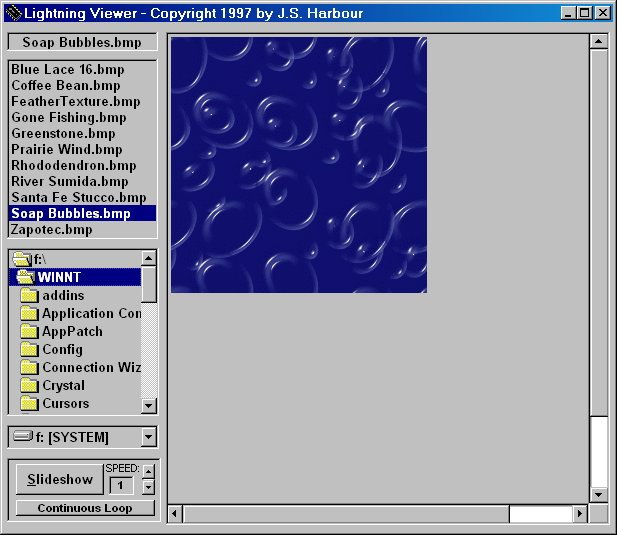



## Lightning Photo Viewer

### Description

Simple, fast photo viewer with scrolling image and looping slideshow with user-defined delay. Supports jpg, gif, bmp, ico, cur, wmf. Source code demonstrates the drive/directory/file controls and their use, along with loading and displaying images in a PictureBox.
 
### More Info
 

             |
---                |---
**Submitted On**   |2000-03-31 11:47:26
**By**             |[Jonathan S\. Harbour](https://github.com/Planet-Source-Code/PSCIndex/blob/master/ByAuthor/jonathan-s-harbour.md)
**Level**          |Beginner
**User Rating**    |4.8 (19 globes from 4 users)
**Compatibility**  |VB 5\.0, VB 6\.0
**Category**       |[Complete Applications](https://github.com/Planet-Source-Code/PSCIndex/blob/master/ByCategory/complete-applications__1-27.md)
**World**          |[Visual Basic](https://github.com/Planet-Source-Code/PSCIndex/blob/master/ByWorld/visual-basic.md)
**Archive File**   |[CODE\_UPLOAD44303312000\.zip](https://github.com/Planet-Source-Code/jonathan-s-harbour-lightning-photo-viewer__1-6915/archive/master.zip)

